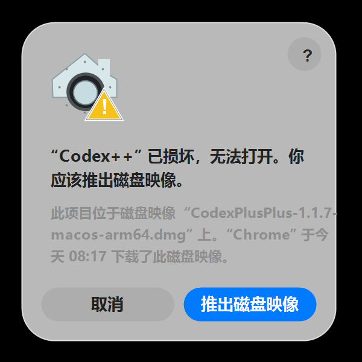

# ChatGPT Codex Tools


[](./README.en.md)
[](./README.ja.md)
[](./README.ko.md)

ChatGPT Codex Tools 是一个独立 Go + React 桌面管理器，用来集中处理 ChatGPT 桌面应用里的 Codex 启动、连接模式、界面增强、脚本、诊断和修复流程。
它把任务式管理界面、Relay 和 Provider 配置、脚本管理、本地修复、桌面下载包和支持诊断放到一个可以单独构建和发布的项目里。

## 包含内容

- Go 后端：负责本地命令分发、静态资源服务和桌面式启动体验。
- React 管理器界面：面向非技术用户，入口清晰、操作集中。
- 新手引导、启动状态、连接模式选择、Relay 配置、历史对话修复、脚本中心、运行日志、诊断报告、修复工具。
- 从当前仓库发布 macOS 和 Windows 桌面下载包。
- 独立仓库结构：不再依赖原始单体仓库路径。

## 目录结构

- `main.go`：二进制入口、构建时角色切换、内嵌资源和共享常量。
- `manager.go`：本地 HTTP 管理器、静态前端服务、命令分发、ChatGPT 桌面应用发现和 CCS 供应商导入。
- `launcher.go`：静默启动器流程、ChatGPT 进程启动、重启处理和启动状态写入。
- `helper.go`：helper HTTP 服务、本地中转代理、CORS 响应和图片/文本中转路由。
- `bridge.go`：Chrome DevTools Protocol 集成、渲染进程桥接注入和桥接请求处理。
- `settings.go`：设置默认值、持久化、仓库根目录发现和前端构建产物查找。
- `relay.go`：中转配置应用、登录/配置状态、配置文件编辑和中转连通性测试。
- `repair.go`：ChatGPT Codex 配置修复、插件恢复、Provider 同步、SQLite/global-state 维护和 TOML 表修复辅助。
- `scripts.go`：脚本市场加载、脚本安装/删除和用户脚本清单。
- `entrypoints.go`：桌面入口、App Bundle、快捷方式安装和 Windows watcher 支持。
- `diagnostics.go`：诊断日志写入、日志截取和支持报告生成。
- `toml.go`：Relay 与修复流程共用的 TOML 字符串工具。
- `util.go`：通用 HTTP、JSON、路径、参数和类型转换辅助函数。
- `types.go`：后端共享数据结构。
- `desktop_darwin.go`、`desktop_other.go`：平台相关的管理器窗口挂钩。
- `web/`：React + Vite 前端。
- `docs/`：GitHub Pages 下载页和公开展示资源。

Go 后端仍然保持在同一个 `package main` 中，这样发布脚本可以继续使用 `-ldflags "-X main.binaryRole=..."`；具体实现按职责拆分，减少多人开发时的冲突，也让模块归属更清楚。

## 本地运行

```bash
npm --prefix web install
npm --prefix web run vite:build
go run .
```

## 构建

```bash
npm --prefix web run check
npm --prefix web run vite:build
go build -o codextools .
```

## 功能说明

1. 首页启动区
   把启动、连接服务、状态检查和修复入口集中到首页，减少非技术用户的判断成本。
2. 中转与 API 管理
   支持官方登录、兼容 API、协议切换、中转测试和注入辅助。
3. 界面增强控制
   管理增强功能、启动模式以及相关辅助能力。
4. 脚本中心
   支持脚本市场安装、本地启用禁用、更新和卸载。
5. 修复与诊断
   集成日志、诊断报告、路径修复和快捷方式修复。
6. 历史对话修复
   提供旧会话提供商归属修复能力，减少“记录看不见”的问题。

## 界面截图

### 首页仪表盘


首页直接显示本地环境是否就绪，提供主要启动按钮，并把连接服务、界面功能、入口修复和关键状态集中到一个页面。

### 新手安装引导


新手流程按顺序完成系统识别、ChatGPT 安装检查、CCSwitch 导入、连接模式选择和启动，降低第一次配置成本。

- 首页仪表盘：展示启动状态、当前连接、界面增强模式、入口路径和关键状态。
- 新手安装引导：按系统识别、ChatGPT 安装、CCSwitch 导入、模式选择、启动 ChatGPT Codex 的顺序完成首次配置。
- 连接服务：集中管理官方登录、官方混合 API、中转 API、供应商列表、CCSwitch 导入和连通性测试；混合 API 会保留官方登录能力，站点/插件市场功能继续可用。
- 界面功能：管理会话删除、Markdown 导出、项目移动、Timeline 和用户脚本。

## 常见问题

以下内容按 ChatGPT Codex Tools 当前项目语境整理。

### ChatGPT Codex Tools 菜单没出现

确认是从 `ChatGPT Codex` 入口启动 ChatGPT 桌面应用。也可以打开管理工具的“诊断”和“日志”页面查看注入状态。

### 插件内显示后端连不上

先在浏览器或 PowerShell 里测试：

```powershell
Invoke-RestMethod -Method Post -Uri http://127.0.0.1:57321/backend/status -Body "{}" -ContentType "application/json"
```

如果接口正常，但插件仍显示超时，通常是 ChatGPT 页面里的 CDP bridge 或脚本缓存问题。重启 ChatGPT Codex 托管的 ChatGPT，或在管理工具里查看日志中的 `renderer.script_loaded`、`bridge.request`、`bridge.response`。

### Upstream worktree 和 ChatGPT Codex 原生创建有什么区别

ChatGPT Codex Tools 的 Upstream worktree 功能等价于先更新远端分支，再执行：

```bash
git worktree add -b <new-branch> <worktree-path> upstream/<base-branch>
```

这样新 worktree 从最新的远端跟踪分支开始，而不是从当前会话所在的本地 HEAD 开始。如果 ChatGPT Codex Tools 无法安全识别当前 ChatGPT Codex 版本的原生 worktree 创建表单，请从 ChatGPT Codex Tools 菜单中手动填写仓库路径、分支名、worktree 路径、remote 和 base branch。

### macOS 提示无法打开或已损坏

当前安装包未签名/未公证时，macOS Gatekeeper 可能拦截 `.pkg` 安装包或安装后的 App，出现“已损坏，无法打开”的提示。



如果遇到该提示，可以在终端执行下面两条命令，解除苹果系统的安全隔离限制：

```bash
sudo xattr -rd com.apple.quarantine ~/Downloads/ChatGPT-Codex-Tools-*-macos-*.pkg
sudo xattr -rd com.apple.quarantine "/Applications/ChatGPT Codex 管理工具.app"
sudo xattr -rd com.apple.quarantine "/Applications/ChatGPT Codex.app"
```

如果拦截发生在安装阶段，先对下载的 `.pkg` 执行第一条命令后重新安装；如果拦截发生在启动阶段，再对 `/Applications` 里的两个 App 执行后两条命令。执行后重新打开 `ChatGPT Codex` 或 `ChatGPT Codex 管理工具` 即可。

### macOS Intel 能用吗

可以。Release 会分别提供 `macos-x64` 和 `macos-arm64` 包。Intel Mac 下载 x64 包，Apple Silicon 下载 arm64 包。

## 下载

- GitHub Pages 下载页：[docs/downloads.html](./docs/downloads.html)
- Windows 同时发布传统 Intel/AMD 电脑使用的安装包（`windows-x64`）和 Windows ARM 设备使用的安装包（`windows-arm64`），并保留两个架构的便携 zip。
- macOS 同时发布 Apple Silicon 安装包（`macos-arm64`）和 Intel Mac 安装包（`macos-x64`），并保留两个架构的便携 zip。

## 电报群

地址：`https://t.me/wanai8`

## 社区链接

我的开源项目已链接认可 LINUX DO 社区：

- LINUX DO：<https://linux.do/>

## 项目理念

重构这个项目的第一个原因，是希望让更多人真正用得上。原项目提供了有价值的基础，但随着代码、产品方向和社区需求变化，项目路线中也出现了一些分歧，以及一些现实层面的原因，所以我希望基于自己的想法继续重构，并发展出一个独立分支。

ChatGPT Codex Tools 就是这个分支。它延续开源开放的精神，让工具更容易安装、更容易理解，也更适合普通用户长期使用。

本项目不接受任何赞助，也不接受捐助。它会以开放式开源项目的方式维护，代码和方向保持公开，欢迎使用、学习、讨论和继续分支发展。

## 项目来源与鸣谢

ChatGPT Codex Tools 是面向当前 ChatGPT 桌面应用内置 Codex 形态的独立 Go 重构和管理器界面项目。
感谢早期社区项目提供的基础能力、工作流思路和面向用户的工具方向。

- ChatGPT 下载入口：<https://chatgpt.com/download/>
- Codex 文档总览：<https://developers.openai.com/codex/>
- 独立项目：<https://github.com/hereww/codextools>

## 说明

- 当前 Go 后端为了兼容已有工作流，仍保留部分面向 Codex/ChatGPT Codex 的命令命名。
- Watcher 安装与移除已补齐 Windows 流程；macOS 会明确显示平台限制，只保留本地启用/禁用标志控制。
